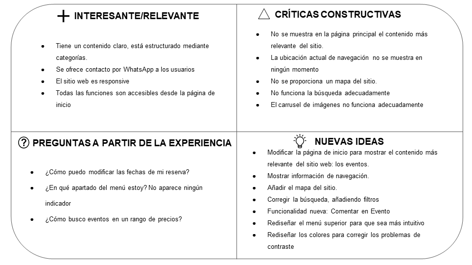
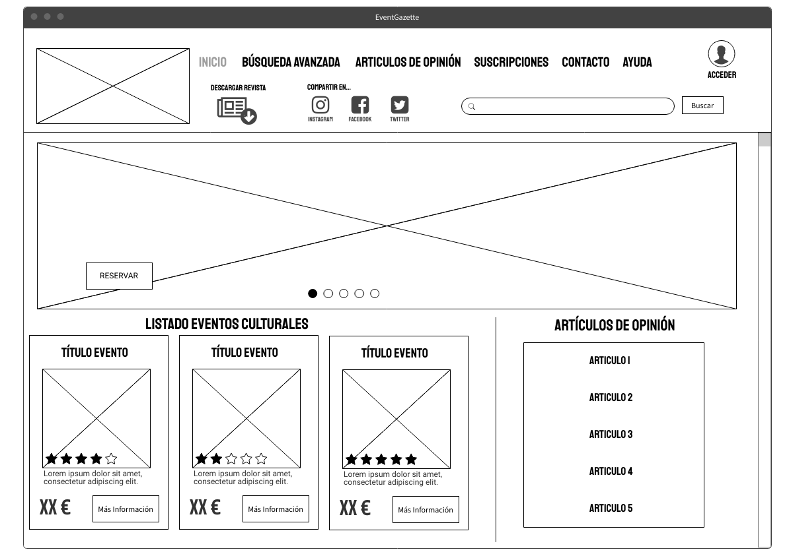

# Parte 2: Caso de estudio. Web YUZIN
> Resolución de un problema, caso y/o supuesto práctico

Caso de estudio: [Yuzin Club Cultural](https://yuzin.com/)

Proyecto de rediseño: EventGazette

Descripción: EventGazette es un portal web que se dedica a publicar eventos y actividades culturales que van a realizarse en Granada. Además cuentan con una revista que contiene todas las actividades que se van a realizar durante un mes. A través de esta web se puede consultar y reservar todo tipo de actividades que se realizan en Granada, viendo el precio, su descripción y todo tipo de detalles asociados a la actividad de una forma sencilla y clara.

Autor: [Víctor José Rubia López](http://github.com/VictorRubia)    :octocat:  

---

Se realizará un proceso de diseño simplificado y medido para confeccionar un proyecto que redefina y mejore al caso de estudio propuesto en un periodo de tiempo acotado. Para conseguir esto, usaré técnicas y herramientas de IU, UX y Usabilidad que hemos estudiado en la asignatura.

# Proceso de análisis

Comenzaremos el proceso de análisis describiendo las competencias principales de Yuzin y definiendo qué herramientas vamos a usar para analizarla en profundidad.

## Primeras herramientas UX. Análisis Básico.

Para comenzar el análisis haremos una pequeña descripción de la funcionalidad y del diseño de la web. Reutilizaremos una persona que ya creamos para otro caso que realizamos en prácticas. Para concluir con esta primera aproximación, realizaremos un Usability Review para conocer las debilidades y ventajas del diseño.

### 1. Descripción del supuesto práctico

> Breve análisis de Yuzin

Yuzin es una empresa que divulga eventos culturales tanto en Granada como Sevilla y Málaga, que poseen una web y una revista. En su web ofrecen la posibilidad a promotores culturales de publicar sus eventos en su web y revista. En su web se puede, además, realizar reservas para estos eventos. Su objetivo es divulgar la cultura y animar a todo el mundo a conocer y realizar actividades.

Su web ofrece información acerca de la agenda cultural y los espacios donde se realiza, artículos de opinión, eventos culturales y opciones para contactarles.
La información que se da de los eventos culturales es **muy básica**.

### 2. Persona

> Reutilización de una persona

Esta persona es la primera herramienta que se plantea para rediseñar el caso propuesto. Se va a usar una persona que se desarrolló en las prácticas de la asignatura. Esta persona se **diseño, revisó y verificó**, por lo que se puede usar para cualquier proyecto y no es para uno en concreto. Por ello, reusaremos a Esteban Ramírez como posible usuario del sitio web para ayudar a encontrar posibles faltas en el servicio que se presta.

### 3. Usability Review

> Revisión de usabilidad

Usaremos un documento de tipo checklist para detectar fallos en las características de diseño mas reseñables del sitio web. El documento completo junto con explicaciones más detallaadas puede leerse [aquí](/doc/Usability-review-template.pdf)

**Puntuación obtenida:** 55 (REGULAR)

Conclusión: Yuzin es un sitio web que tiene el **contenido desorganizado** y al tener tantas opciones su principal desventaja es la dificultad en términos de accesibilidad a los principales objetivos que pueden tener los usuarios. Se echa mucho en falta que el contenido más relevante ocupe una posición importante en la pantalla principal, así como el etiquetado de las distintas opciones, que en la mayoría de casos es solamente mediante iconos. Otras funcionalidades que se echan en falta son el poder realizar comentarios en los eventos, tener ayuda en línea,  un mapa del sitio web y que los formularios ofrezcan ayuda para completarse.

## Análisis más exhaustivo. Evaluación de Accesibilidad

A continuación vamos a realizar un análisis de accesibilidad para determinar, de forma más exhaustiva, las carencias en el diseño para luego poder redefinirlas.

### 1. Documento de accesibilidad

> Informe de accesibilidad

Evaluamos distintos aspectos relacionados con la accesibilidad y encontramos muchos errores que provienen de no seguir las pautas WCAG y que dificultan navegar adecuadamente sin archivos CSS o JS. Estas características deben ser rediseñadas en el nuevo proyecto. Puede leer el informe completo [aquí](/doc/Accesibilidad.pdf)

# Proceso de Diseño

A continuación, comenzaremos estableciendo las bases de nuestra nueva propuesta de valor y terminaremos con los prototipos necesarios para que todas las partes interesadas en el proyecto puedan hacerse una idea del resultado de este proceso de rediseño.

## Comienzos del proceso de rediseño

Sacaremos a la luz los puntos que van a hacer de nuestro proyecto de rediseño una alternativa al uso de Yuzin, salvando sus puntos críticos y usando sus buenas prácticas en cuanto a diseño.

### 1. Feedback Capture Grid

> Nueva propuesta de valor

Agrupamos puntos fuertes y débiles y utilizamos a nuestra persona Esteban Ramírez para conseguir preguntas a partir de la experiencia. Obtenemos una serie de nuevas ideas que resumo a modo de conclusión.

Conclusión: la nueva propuesta de valor, EventGazette, tendrá dos puntos fuertes a considerar.

- **El rediseño:** nuevo diseño de la página principal, resaltando el contenido principal de la empresa, las actividades culturales. Además rediseñaremos el menú superior resaltando la opción que esté seleccionada, así como el rediseño de los colores relacionados con el contraste para solucionar los problemas que detectamos en cuanto la accesibilidad.
- **Nuevos items:** información de navegación, mapa del sitio, comentarios en eventos, búsqueda con filtros, apartado de ayuda.

### 2. Sitemap
> Definir un nuevo mapa del sitio

A continuación, se define el mapa del sitio, que no se incluye en Yuzin y que marcará la diferencia en nuestra propuesta de proyecto. No se va a realizar un labelling ya que los términos van a ser los mismos que ya se utilizan en Yuzin.

## Prototipado final del proceso de diseño

## 1. Guidelines

> Rediseño de los colores y la tipografía

Para seguir, realizamos un Style Guide para comprobar de forma visual el resultado del rediseño de las tipografías y resolveremos los problemas de contraste usando la herramienta online [Contrast Checker](https://webaim.org/resources/contrastchecker/)

- Utilizaremos la fuente [Staatliches](https://fonts.google.com/specimen/Staatliches#standard-styles) para los títulos, ya que es una tipografía expresiva.

- Utilizaremos la fuente [Roboto](https://fonts.google.com/specimen/Roboto) para el cuerpo del texto, ya que es una tipografía sencilla y clara.

## 2. Wireframes

> Bocetos de algunas pantallas esenciales de EventGazette

Los siguientes bocetos presentan un buen nivel de detalle para mostrar las páginas de Inicio y Búsqueda Avanzada

# Conclusión

Con EventGazette pretendemos llegar al mayor número de personas interesadas posible. He ofrecido una propuesta de diseño bastante mejorada y más funcional que el caso propuesto. Para ello, he suplido todos sus defectos identificados en la primera parte de la aproximación al rediseño.

Debido a la importancia que tiene para esta empresa su revista, hemos colocado un símbolo que destaca en la pantalla principal cuya descripción nos ayuda a saber que es para descargarla.

Tras todo el proceso de análisis y rediseño, comprobamos cómo todos los fallos destacables han sido **corregidos, añadidos o rediseñados** para obtener una página web más atractiva y funcional para que brinde a sus usuarios habituales y nuevos más facilidad de uso.
